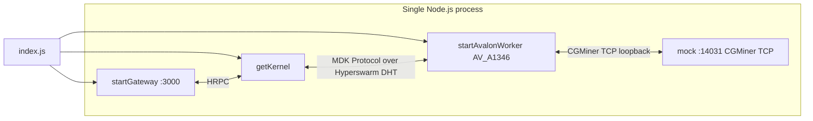

# MDK Avalon Miner Example

A small, self-contained **Avalon A1346 miner** site you can run with **no real hardware**.
One Kernel and one Avalon A1346 Worker in a single Node.js process, backed by a **mock** Avalon
device speaking CGMiner's TCP protocol, so the whole site comes up on `localhost` and is
immediately verifiable.

## What it demonstrates

- Bringing up a Kernel + one Worker + a Gateway in one process.
- Starting a **mock Avalon A1346 miner** and **registering** it as a thing.
- Live mock telemetry pulled through the Kernel over the MDK Protocol — no hardware.

## Prerequisites

- **Node.js >= 24**
- Monorepo dependencies installed (from the repo root):

```bash
npm install   # backend/core, backend/plugins and backend/workers are all root workspace members
```

> Without these the example fails at startup with `Cannot find module 'debug'` (or similar). This is
> the most common first-run problem — install before anything else.

## Architecture



The Worker polls its mock over CGMiner's TCP protocol on loopback, exactly as it would poll a
real Avalon miner. A Gateway also boots alongside the Kernel, on `http://localhost:3000` — it
declares no plugins, so it serves no application routes; see [declaring a plugin MDK
ships](../../../../backend/core/plugins/README.md#declare-a-plugin-in-your-stack) to add one.

## Workers and mocks

| Worker class | Mock type | Mock port | `serialNum` | `container` |
|---|---|---|---|---|
| `AV_A1346` | `a1346` | 14031 | `AV001` | `av-1` |

The device is registered with `password: 'admin'`.

## Quickstart

```bash
node examples/backend/miners/avalon/index.js     # from the repo root
# or: cd examples/backend/miners/avalon && npm start
```

On startup the Kernel HRPC key and, once the Worker has registered, its device id are printed. After
~20–30 s the Worker has joined the DHT and its device is live. `Ctrl+C` shuts everything down
cleanly.

## Verifying it works

This example has no `verify.js` and the Gateway declares no plugins, so it exposes no HTTP routes
to query. The signal that the site is live is the console output itself — once the device id is
printed with no error, the mock is registered and the Worker is polling it over CGMiner's TCP
protocol:

```text
Kernel HRPC key: <hex>
MDK running at http://localhost:3000
  Device: <device-id>

  Ctrl+C to stop.
```

To confirm live telemetry, or to reach the fleet over HTTP, declare a Gateway plugin — see
[declaring a plugin MDK ships](../../../../backend/core/plugins/README.md#declare-a-plugin-in-your-stack)
or [build your own](../../../../docs/guides/gateway/plugins.md).
